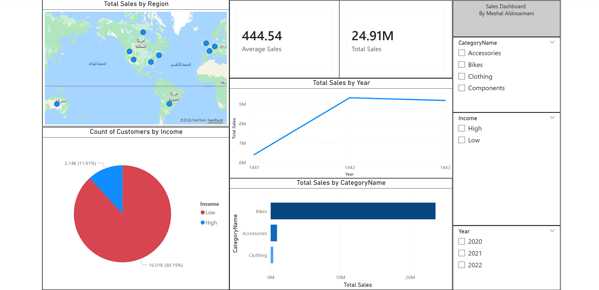

# AdventureWorks Sales Dashboard

## Overview
This project is an interactive Power BI dashboard built using the AdventureWorks dataset. It provides insights into sales performance through data modeling, DAX measures, and interactive visualizations.

## Tools Used
- Power BI
- Power Query
- DAX
- Data Modeling

## Key Features
- Total Sales KPI
- Average Sales KPI
- Sales by Category
- Sales by Region
- Sales Trend by Year
- Interactive Slicers

## Dashboard Preview

## Files
- AdventureWorks.pbix
- Dashboard Screenshot
